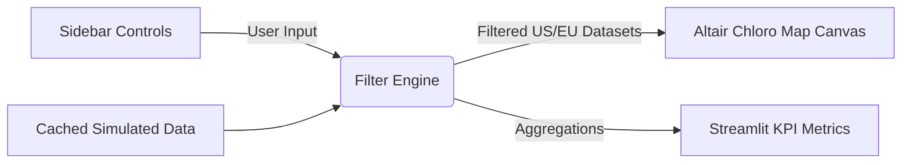

# Enterprise Analytics Interactive Map Canvas

An interactive, high-density infographic dashboard designed for enterprise spatial analytics. It utilizes custom CSS to inject a modern neon dark theme and leverages Altair for geographical choropleth visualizations of business metrics across the United States and Continental Europe.

**Created by: Srinivasta**

🚀 **[View the Live Web Application](https://high-density-analytics-canvas-5i2unuexfjdaam2enee6sa.streamlit.app/)**


---

## 🚀 Key Features

*   **Custom Neon Dark Theme:** Native Streamlit UI elements customized via injected CSS overrides for an operations-center aesthetic.
*   **Dynamic Data Simulation:** Cached generation of geographic business performance metrics (Gross Revenue and Net Profit).
*   **Dual Geographic Canvas:** Side-by-side synchronized choropleth maps using Vega topologies (`us_10m` and `world_110m`).
*   **Interactive Control Panel:** Dynamic sidebar configuration tools supporting multi-select territory filtration and on-the-fly metric switching.
*   **Financial KPI Summaries:** High-level summary metric blocks detailing aggregated performance across filtered zones.

---

## 🛠️ Project Structure & Architecture

```text
├── app.py           # Main Streamlit web application entrypoint
└── README.md        # Technical project documentation
```

### Technical Workflow



1. **Initialization:** Configuration of wide desktop canvas properties (`st.set_page_config`) and global custom visual rules applied to the underlying visualization engines.
2. **Data Pipeline:** Numeric ISO 3166-1 numeric topologies mapped explicitly against business nomenclature strings to guarantee join safety during Vega lookups.
3. **Reactive Transformation:** Multi-select state arrays automatically construct boolean masks against the core DataFrame layout, modifying chart vectors and visual aggregation nodes instantly.

---

## 💻 Technical Stack

*   [Streamlit](https://streamlit.io) - Core application architecture and responsive layout scaffolding.
*   [Altair](https://github.io) - Declarative statistical visualization wrapper for declarative topology joins.
*   [Pandas](https://pydata.org) & [NumPy](https://numpy.org) - Structured high-performance data filtration matrices.
*   [Vega Datasets](https://github.com) - Clean source vector maps (`us_10m`, `world_110m`).

---

## 📦 Setup & Execution Instructions

Follow these steps to initialize the application framework locally:

### 1. Environment Optimization
Ensure Python 3.9+ is active on your host system environment.

### 2. Dependency Installation
Create a localized workspace execution layer and deploy the required component packages:
```bash
pip install streamlit pandas numpy altair vega_datasets
```

### 3. Launching the Cluster Application
Execute the local runtime process hosting layer via terminal command pipelines:
```bash
streamlit run app.py
```

---

## 📋 Ongoing Development & Roadmap

Contributions are welcome! If you want to expand this application framework, consider implementing:
*   **Live Database Connection:** Migrating the simulation engine layer to **live Postgres / Snowflake** query structures.
*   **Drill-Down Actions:** Adding cross-filtering behavior where clicking a territory dynamically filters secondary **historical bar/line charts**.
*   **GeoJSON Expansion:** Implementing high-resolution state-to-county transition layers for ultra-localized analytics views.

---

## 👤 Author

*   **Srinivasta** - [GitHub Profile](https://github.com/srinivasta)
